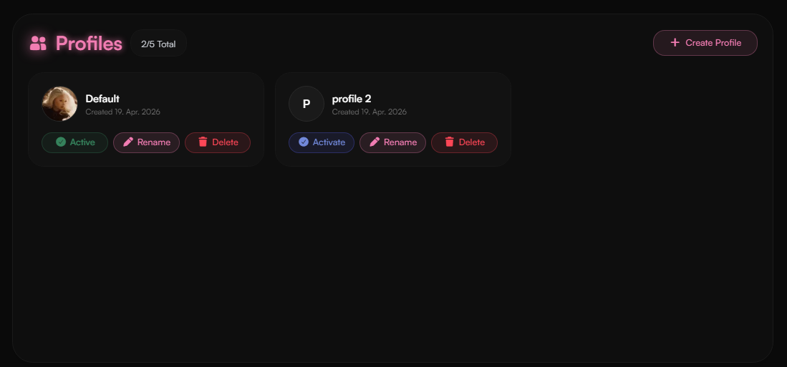
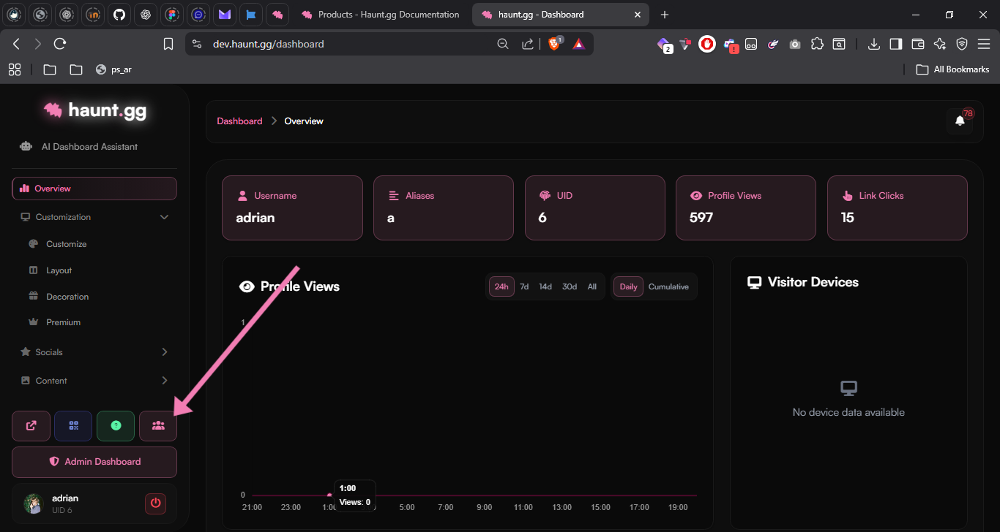
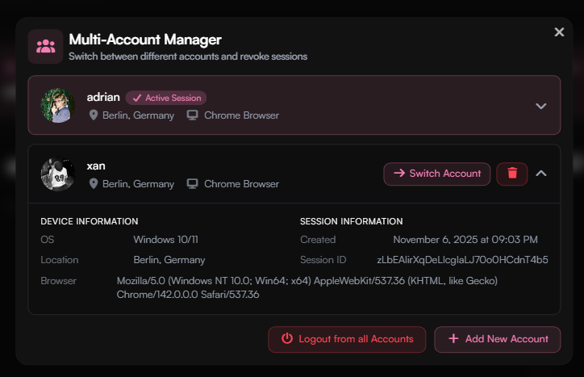

<Card title="Multiaccounting Policy" icon="circle-1" href="../guides/multiaccounting#multiaccounting-policy" horizontal>
Learn more about the multiaccounting policy.
</Card>

<Card title="Creating multiple accounts" icon="circle-2" href="../guides/multiaccounting#creating-multiple-accounts" horizontal>
Learn how to create multiple accounts on haunt.gg.
</Card>

<Card title="Unban previously banned accounts" icon="circle-3" href="../guides/multiaccounting#unban-previously-banned-accounts" horizontal>

Learn how to unban previously banned accounts.
</Card>

## Difference between multiaccounting and multi-profiles

| Multiaccounting             | Multi-Profiles                                   |
| --------------------------- | ------------------------------------------------ |
| Multiple Haunt **accounts** | Multiple **profiles** for **one** Haunt account  |

## Multi-Profiles

Multi-Profiles allow you to create multiple profiles under a single haunt account. Each profile can have its own customizations, links, and settings. This is useful for users who want to manage different personas or projects without needing to create separate accounts.

Profile Limit:
    - <Badge icon="user" color="gray">Free</Badge>: **``3``**
    - <Badge icon="star" color="purple">Premium</Badge>: **``5``**

<Frame>
    
</Frame>

---

## Multiaccounting
### Multiaccounting policy

<Note>
Multiaccounting is allowed with limitations.
</Note>

| Free                         | Premium on main account           |
| ---------------------------- | --------------------------------- |
| Create up to **3 accounts**  | Create up to **5 accounts**       |

- The profiles must be active, like having customizations, links, etc.
- We reserve the right to ban accounts that do not meet the requirements.

---

### Creating multiple accounts

Multiple accounts can be easily created by [registering](https://haunt.gg/register) with a different email address.  
Our system will automatically detect if you have multiple accounts.

---

### Multi-Account Manager

The **Multi-Account Manager** allows you to manage multiple Haunt accounts using a single browser.

<Steps>
<Step title="Open the Multi-Account Manager">
Open the [**dashboard**](https://haunt.gg/dashboard) and click the **Multi-Account Manager** button.
<Frame>

</Frame>
</Step>

<Step title="Interface">
In the interface, you can add accounts, log out of accounts, switch between accounts, and view session information.
<Frame>

</Frame>
</Step>
</Steps>
